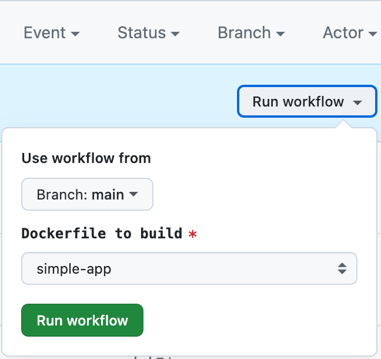

# Simple app

### Простой сайт, завернутый в nginx docker контейнер
- Сборка осуществляется с помощью Github Action `Build and publish a Docker image to GHCR`, запущенный вручную. 
- В настройках запуска контейнера указана опция `simple-app`, указывающий на папку с соответствущим [Dockerfile](Dockerfile)



- После успешной сборки контейнер пушится в Github Container Registry c тегом имени бранча (`main`)
- Docker container доступен по ссылке `ghcr.io/dens-al/docker-study/simple-app:main`

```sh
docker pull ghcr.io/dens-al/docker-study/simple-app:main
```

- После успешного запуска контейнера будет доступен сайт на 80 порту адреса `http://<адрес_хоста>/`


